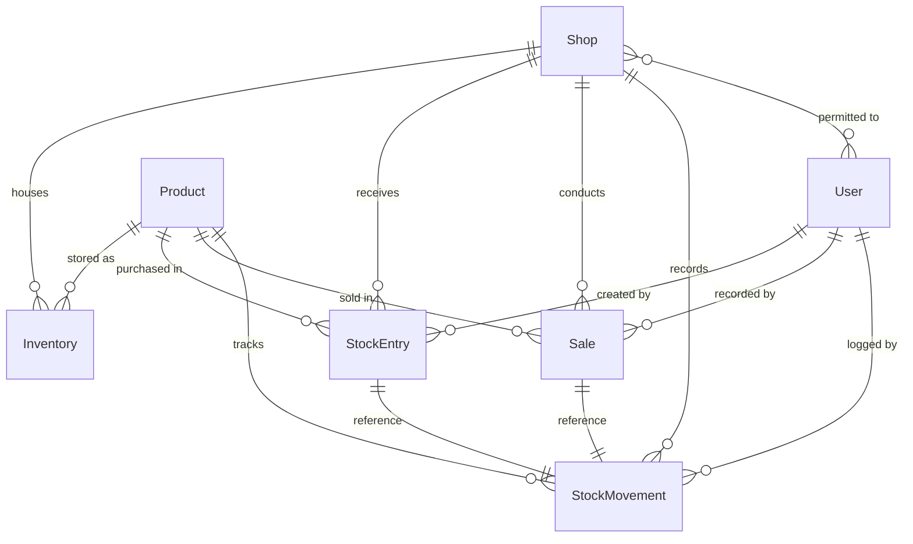

# Chittagong Auto Parts Inventory & Supply Tracker — Backend API

Production-grade, secure, multi-shop REST API backend built for auto parts businesses in Bangladesh (serving Chittagong Shop, Dhaka Shop, and dynamically expandable to new branches).

---

## 🌟 Key Features

* **Authentication & Authorization**:
  * Phone Number + Password (no email required).
  * Strict Bangladeshi phone number normalization (`01XXXXXXXXX`).
  * Strong password hashing using `bcrypt`.
  * Role-Based Access Control (`ADMIN` vs `STAFF`).
  * Permitted shop data isolation (Staff can only access designated shops).
* **Multi-Shop Architecture**:
  * Multi-branch stock management with dynamic shop creation.
  * Automatic slug normalization for shop codes.
  * Inactive shop protection (prevents new stock/sales transactions on closed shops).
* **Accurate Stock Accounting & Weighted-Average Costing**:
  * Real-time calculation:
    $$\text{New Average Unit Cost} = \frac{\text{Current Qty} \times \text{Current Avg Cost} + \text{Incoming Qty} \times \text{Incoming Cost}}{\text{Current Qty} + \text{Incoming Qty}}$$
  * 2-decimal-place precision arithmetic to avoid floating-point drift.
  * Preserves original purchase records and supplier names.
* **Concurrency-Safe Sales & Profit Capture**:
  * Atomic stock deductions preventing overselling under concurrent requests.
  * Exact financial tracking:
    * $\text{Total Selling Price} = \text{Quantity Sold} \times \text{Selling Rate}$
    * $\text{Cost of Goods Sold (COGS)} = \text{Quantity Sold} \times \text{Unit Cost at Sale}$
    * $\text{Gross Profit} = \text{Total Selling Price} - \text{COGS}$
  * Freezes `unitCostAtSale` and `grossProfit` at the exact moment of sale (never mutated when future stock arrives at different prices).
* **Audit & History Ledger**:
  * Immutable `StockMovement` history for all incoming stock, customer sales, and manual adjustments.
* **Dual Dashboards & Reporting**:
  * **Global Combined Dashboard**: Aggregates distinct product count across the entire business, total stock units, inventory valuation, period revenue, and gross profit with per-shop breakdown.
  * **Individual Shop Dashboard**: Shop-specific performance, low-stock alerts, and recent transactions.
  * Built-in support for `Asia/Dhaka` business timezone.
* **Interactive API Documentation**:
  * Swagger / OpenAPI 3.0 documentation served at `/api/docs`.

---

## 🛠️ Technology Stack

* **Runtime**: Node.js v20+ / v24+
* **Language**: TypeScript (Strict Mode)
* **Framework**: Express.js
* **Database**: MongoDB with Mongoose ODM
* **Validation**: Zod (Schema-based request validation)
* **Authentication**: JWT (JSON Web Tokens) + bcryptjs
* **Logging**: Pino & Pino-HTTP structured JSON logger
* **Security**: Helmet, CORS, Express Rate Limit
* **Documentation**: OpenAPI 3.0 / Swagger UI Express
* **Testing**: Vitest + Supertest + MongoDB Memory Server

---

## 📋 Database Model Relationships



---

## 🚀 Getting Started

### 1. Prerequisites
* Node.js >= 20.x
* MongoDB (Local standalone or MongoDB Atlas cluster)

### 2. Installation
```bash
npm install
```

### 3. Environment Configuration
Copy `.env.example` to `.env` and configure:
```env
NODE_ENV=development
PORT=5000
MONGODB_URI=mongodb://localhost:27017/chittagong_auto_parts
JWT_SECRET=super_secret_jwt_key_chittagong_auto_parts_2026_min_32_chars
JWT_EXPIRES_IN=7d
CLIENT_ORIGIN=http://localhost:3000,http://localhost:5173
BOOTSTRAP_ADMIN_NAME="System Administrator"
BOOTSTRAP_ADMIN_PHONE="01811000000"
BOOTSTRAP_ADMIN_PASSWORD="AdminPassword123!"
APP_TIMEZONE=Asia/Dhaka
RATE_LIMIT_WINDOW_MS=900000
RATE_LIMIT_MAX=200
AUTH_RATE_LIMIT_MAX=20
```

### 4. Seed Database (Optional Sample Data)
```bash
npm run seed
```

### 5. Start Development Server
```bash
npm run dev
```

### 6. Run Automated Tests
```bash
npm test
```

### 7. Production Build & Start
```bash
npm run build
npm start
```

---

## 📚 API Endpoint Summary

### Authentication (`/api/v1/auth`)
| Method | Endpoint | Description | Access |
|---|---|---|---|
| `POST` | `/api/v1/auth/login` | Login with Phone & Password | Public (Rate limited) |
| `GET` | `/api/v1/auth/me` | Get authenticated user profile | Authenticated |
| `POST` | `/api/v1/auth/logout` | Invalidate client session | Authenticated |

### User Management (`/api/v1/users`)
| Method | Endpoint | Description | Access |
|---|---|---|---|
| `GET` | `/api/v1/users` | List users with pagination & role filters | Admin Only |
| `POST` | `/api/v1/users` | Create new Staff or Admin user | Admin Only |
| `GET` | `/api/v1/users/:userId` | Get user details | Admin Only |
| `PATCH` | `/api/v1/users/:userId` | Update user details & shop permissions | Admin Only |

### Shops (`/api/v1/shops`)
| Method | Endpoint | Description | Access |
|---|---|---|---|
| `GET` | `/api/v1/shops` | List authorized shops | Authenticated |
| `GET` | `/api/v1/shops/:shopId` | View shop details | Authorized Staff / Admin |
| `POST` | `/api/v1/shops` | Create dynamic new shop | Admin Only |
| `PATCH` | `/api/v1/shops/:shopId` | Update shop details | Admin Only |
| `PATCH` | `/api/v1/shops/:shopId/status`| Toggle active/inactive status | Admin Only |

### Inventory & Stock (`/api/v1/shops/:shopId/inventory`)
| Method | Endpoint | Description | Access |
|---|---|---|---|
| `GET` | `/api/v1/shops/:shopId/inventory` | List shop inventory with low-stock filter | Authorized Staff / Admin |
| `GET` | `/api/v1/shops/:shopId/inventory/:productId` | Product balance & valuation in shop | Authorized Staff / Admin |
| `PATCH` | `/api/v1/shops/:shopId/inventory/:productId`| Update selling rate or threshold | Authorized Staff / Admin |

### Stock Entries (`/api/v1/shops/:shopId/stock-entries`)
| Method | Endpoint | Description | Access |
|---|---|---|---|
| `POST` | `/api/v1/shops/:shopId/stock-entries` | Record stock-in & update weighted cost | Authorized Staff / Admin |
| `GET` | `/api/v1/shops/:shopId/stock-entries` | List stock purchase history | Authorized Staff / Admin |
| `GET` | `/api/v1/shops/:shopId/stock-entries/:entryId` | Get stock entry details | Authorized Staff / Admin |

### Sales (`/api/v1/shops/:shopId/sales`)
| Method | Endpoint | Description | Access |
|---|---|---|---|
| `POST` | `/api/v1/shops/:shopId/sales` | Record customer sale with profit capture | Authorized Staff / Admin |
| `GET` | `/api/v1/shops/:shopId/sales` | List shop sales history | Authorized Staff / Admin |
| `GET` | `/api/v1/shops/:shopId/sales/:saleId` | Get sale details | Authorized Staff / Admin |

### History & Auditing (`/api/v1/shops/:shopId/stock-movements`)
| Method | Endpoint | Description | Access |
|---|---|---|---|
| `GET` | `/api/v1/shops/:shopId/stock-movements` | Full immutable stock change ledger | Authorized Staff / Admin |
| `GET` | `/api/v1/shops/:shopId/sales-history` | Filtered sales history | Authorized Staff / Admin |
| `GET` | `/api/v1/shops/:shopId/stock-history` | Filtered purchase history | Authorized Staff / Admin |

### Dashboards (`/api/v1/dashboard`)
| Method | Endpoint | Description | Access |
|---|---|---|---|
| `GET` | `/api/v1/dashboard/overview` | Global combined dashboard across all shops | Authenticated |
| `GET` | `/api/v1/shops/:shopId/dashboard` | Individual shop dashboard & alerts | Authorized Staff / Admin |

---

## 💻 Frontend Integration Example (React / Axios)

```typescript
import axios from 'axios';

const api = axios.create({
  baseURL: 'http://localhost:5000/api/v1',
  headers: {
    'Content-Type': 'application/json'
  }
});

// Attach Bearer token
api.interceptors.request.use((config) => {
  const token = localStorage.getItem('auth_token');
  if (token) {
    config.headers.Authorization = `Bearer ${token}`;
  }
  return config;
});

// 1. Phone + Password Login
export async function login(phone: string, password: string) {
  const response = await api.post('/auth/login', { phone, password });
  const { token, user } = response.data.data;
  localStorage.setItem('auth_token', token);
  return user;
}

// 2. Record Customer Sale
export async function recordSale(shopId: string, productId: string, quantitySold: number, sellingRatePerPiece?: number) {
  const response = await api.post(`/shops/${shopId}/sales`, {
    productId,
    quantitySold,
    sellingRatePerPiece
  });
  return response.data.data;
}

// 3. Fetch Global Dashboard Overview
export async function fetchDashboard(period = '30d') {
  const response = await api.get('/dashboard/overview', {
    params: { period }
  });
  return response.data.data;
}
```

---

## 🔒 Security & Deployment Notes

* **MongoDB Replica Sets**: For atomic multi-document transactions in production, connect to a MongoDB replica set (e.g. MongoDB Atlas). If deployed on a single standalone MongoDB, the built-in `withTransaction` utility automatically operates safely.
* **Environment Bootstrap**: The system bootstraps the primary Admin user and default shops on initial launch without exposing any insecure public registration routes.
